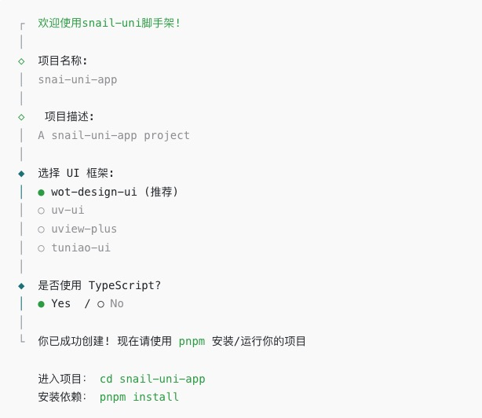

<h1 align="center">🌾 Create-snail-uni 🌾</h1>
<p align="center">
    <a href="https://www.npmjs.com/package/create-snail-uni"></a>
    <a href="https://www.npmjs.com/package/create-snail-uni"></a>
</p>

<p align="center">snail-uni脚手架工具</p>

## 🌴 介绍

`create-snail-uni` 是一个用于快速构建 `snail-uni` 项目的脚手架工具。内置命令行创建向导，可以帮助你快速搭建一个 基于 `Vite` + `Vue3` + `Typescript` + `Pinia` + `Sass` 的 `uni-app` 项目，同时也支持命令行选项直接创建你想要的项目。

- [项目文档](https://hu-snail.github.io/snail-uni/)
- [github地址](https://github.com/hu-snail/snail-uni)
- [gitee地址](https://gitee.com/hu-snail/snail-uni)

## 🚀 使用

### 一.命令导向方式

```sh
# npm
npx snail-uni create
# pnpm
pnpm create snail-uni 
# yarn
yarn create snail-uni

```

将需要回答几个简单的问题：



### 二.命令行选项

语法：`snail-uni create <project-name> <语言类型（js/ts）>` 不指定类型默认为 `js` 版本， `ts` 版本如下

```sh
# npm
npx snail-uni create snail-uni-app ts

# pnpm
pnpm create snail-uni snail-uni-app ts

# yarn
yarn create snail-uni snail-uni-app ts
```

执行完之后，将生成一个新的项目


