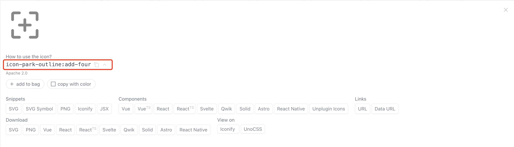
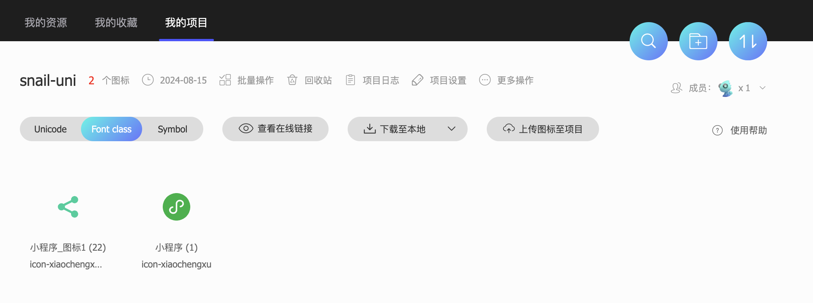
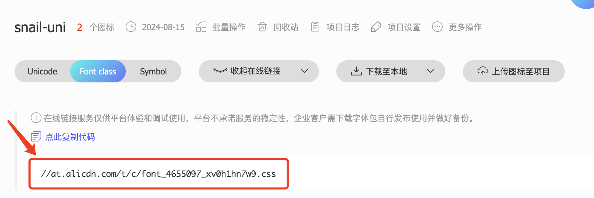
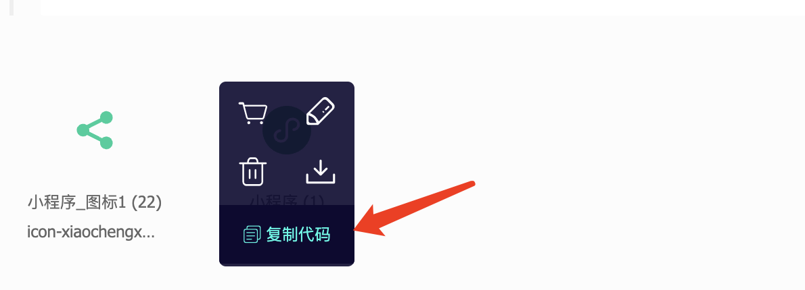

# 图标
本项目推荐使用图标方案：
- UI 图标库
- UnoCSS + Iconify 图标库
- Iconfont 图标库
## UI 图标库
`snail-uni` 推荐UI组件库分别是：`wot-design-ui` ,  `uv-ui`, `uview-plus` ,  `tuniao-ui` , 选择你安装的UI组件库，查看相应文档获取图标使用方式。

###  wot-design-ui
> 具体使用，请查看[文档](https://wot-design-uni.pages.dev/component/icon.html)


```vue
<!--  通过 name 属性设置使用哪个图标。 -->
<wd-icon name="add-circle" />
<!--  通过 size 属性设置图标大小 -->
<wd-icon name="add-circle" size="20px" />
<!--  通过 color 属性设置图标颜色 -->
<wd-icon name="add-circle" color="#409EFF" />
```

### uv-ui
> 具体使用，请查看[文档](https://www.uvui.cn/components/icon.html)

```vue
<uv-icon name="photo"></uv-icon>
<uv-icon name="photo" color="#2979ff" size="28"></uv-icon>
```
### uview-plus
> 具体使用，请查看[文档](https://uiadmin.net/uview-plus/components/icon.html)

```vue
<up-icon name="photo"></up-icon>
<up-icon name="photo" color="#2979ff" size="28"></up-icon>
```
### tuniao-ui
> 具体使用，请查看[文档](https://vue3.tuniaokj.com/doc/component/icon.html)

```vue
<TnIcon name="logo-tuniao" type="primary" />
<TnIcon name="logo-tuniao" color="tn-blue" />
<TnIcon name="logo-tuniao" transparent transparent-bg="tn-green" />

```

## UnoCSS + Iconify 图标库
`UnoCSS Icons` 可轻松接入[iconify](https://icones.js.org/) 图标库，`iconify` 拥有 `10w+` 海量图标。`snail-uni` 默认集成了字节图标库 `@iconify-json/icon-park-outline`, 通过[iconify 图标集](https://icones.js.org/collection/icon-park-outline) 查看具体图标

### 使用案例
以 `@iconify-json/icon-park-outline` 为例：
### 安装图标库
::: code-group
```sh [npm]
npm install @iconify-json/icon-park-outline -D
```
```sh [pnpm]
pnpm add  @iconify-json/icon-park-outline -D
```
```sh [yarn]
yarn add  @iconify-json/icon-park-outline -D
```
:::

### unocss图标配置
```ts
// uno.config.ts
export default defineConfig({
  presets: [
    ...,
    // 配置图标
    presetIcons({
      scale: 1.2,
      warn: true,
      prefix: 'sn-',
      autoInstall: true,
      extraProperties: {
        display: 'inline-block',
        'vertical-align': 'middle',
      },
    })
  ],
```
**配置说明**： 
- `scale`: 放大倍数，
- `warn`: 是否开启警告，
- `prefix`: 图标前缀，在使用图标时，需要加上前缀，如：`sn-icon-name`
- `autoInstall`: 是否自动安装图标库，
- `extraProperties`: 额外属性

### 页面中使用
在使用之前请先打开[icon-park-outline 图标集](https://icones.js.org/collection/icon-park-outline)，以 `add-four` 为例，点击复制`icon-park-outline:add-four`, 在项目中使用记得添加图标前缀 `sn-`



- 代码示例, 使用 `class` 类名添加：

```vue
<template>
  <button class="sn-icon-park-outline:add-four" />
</template>
```

### 修改图标大小/颜色
通过自定义类名`sn-icon`, 修改 `color` 和 `font-size` 即可：
```vue
<template>
  <button class="sn-icon sn-icon-park-outline:add-four" />
</template>

<style lang="scss" scoped>
  .sn-icon {
    color: #f45;
    font-size: 14px;
  }
</style>
```

## iconfont 图标库
`iconfont` 是阿里的图标库，国内功能很强大且图标内容很丰富的矢量图标库。拥有海量免费的的图标资源，同时支持上传自己的图标。
### 图标项目
- 图标官网地址： [iconfont](https://www.iconfont.cn/)

`snail-uni` 推荐方案使用 `Font Class` 模式，兼容性且方便引用。`Symbol` 兼容性较差，不推荐。
  
> 加入或者创建项目（公司/个人），以 `snail-uni` 项目图标为案例：



### 使用案例
选择 `Font Class` 点击 `查看在线链接` , 第一次点击会提示 `暂无代码，点此生成` ， 按照提示操作生成链接如下：


点击链接会生成代码如下：
```css
@font-face {
  font-family: "iconfont"; /* Project id 4655097 */
  src: url('//at.alicdn.com/t/c/font_4655097_xv0h1hn7w9.woff2?t=1723726575635') format('woff2'),
       url('//at.alicdn.com/t/c/font_4655097_xv0h1hn7w9.woff?t=1723726575635') format('woff'),
       url('//at.alicdn.com/t/c/font_4655097_xv0h1hn7w9.ttf?t=1723726575635') format('truetype');
}

.iconfont {
  font-family: "iconfont" !important;
  font-size: 16px;
  font-style: normal;
  -webkit-font-smoothing: antialiased;
  -moz-osx-font-smoothing: grayscale;
}

.icon-xiaochengxu_tubiao:before {
  content: "\e608";
}

.icon-xiaochengxu:before {
  content: "\e63a";
}
```
::: warning 温馨提示
上述代码中：`//at.alicdn.com` 路径要改为 `https://at.alicdn.com`，因为 `APP` 里面 `//`是文件协议。
::: details 查看修改后的代码
```css
@font-face {
  font-family: 'iconfont'; /* Project id 4655097 */
  src:
    url('https://at.alicdn.com/t/c/font_4655097_xv0h1hn7w9.woff2?t=1723726575635') format('woff2'),
    url('https://at.alicdn.com/t/c/font_4655097_xv0h1hn7w9.woff?t=1723726575635') format('woff'),
    url('https://at.alicdn.com/t/c/font_4655097_xv0h1hn7w9.ttf?t=1723726575635') format('truetype');
}

.iconfont {
  font-family: 'iconfont' !important;
  font-size: 16px;
  font-style: normal;
  -webkit-font-smoothing: antialiased;
  -moz-osx-font-smoothing: grayscale;
}

.icon-xiaochengxu_tubiao:before {
  content: '\e608';
}

.icon-xiaochengxu:before {
  content: '\e63a';
}
```
:::

复制上述代码在 `src/styles` 目录下创建 `iconfont.css` 文件
> 注： 拷贝修改后代码
::: details 查看代码
```css
@font-face {
  font-family: 'iconfont'; /* Project id 4655097 */
  src:
    url('https://at.alicdn.com/t/c/font_4655097_xv0h1hn7w9.woff2?t=1723726575635') format('woff2'),
    url('https://at.alicdn.com/t/c/font_4655097_xv0h1hn7w9.woff?t=1723726575635') format('woff'),
    url('https://at.alicdn.com/t/c/font_4655097_xv0h1hn7w9.ttf?t=1723726575635') format('truetype');
}

.iconfont {
  font-family: 'iconfont' !important;
  font-size: 16px;
  font-style: normal;
  -webkit-font-smoothing: antialiased;
  -moz-osx-font-smoothing: grayscale;
}

.icon-xiaochengxu_tubiao:before {
  content: '\e608';
}

.icon-xiaochengxu:before {
  content: '\e63a';
}
```
:::

### 页面中使用
- 复制代码

- 页面代码
```vue
 <template>
  <i class="iconfont icon-xiaochengxu"></i>
</template>
```
- 修改大小和颜色
```vue
<template>
  <i class="iconfont icon-xiaochengxu"></i>
</template>

<style lang="scss" scoped>
  .iconfont {
    color: #f45;
    font-size: 14px;
  }
</style>
```
