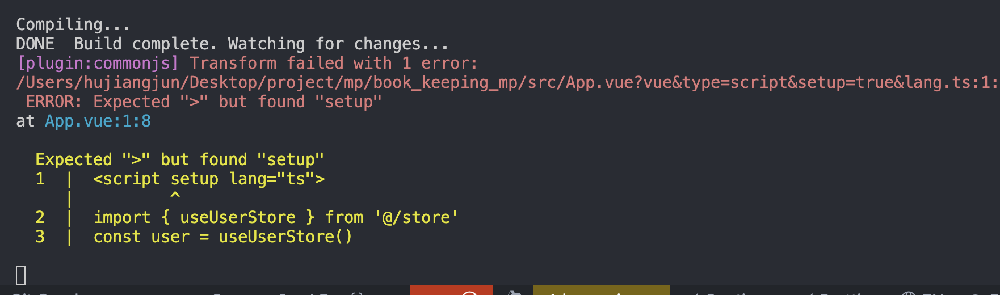

# 常见问题

本篇介绍了使用 `snail-uni` 中一些常见问题

## 1.pages.json 修改被覆盖, 如何修改页面的 `style` 样式 ?

```vue
<route lang="json">
{
  "style": { 
    "navigationBarTitleText": "snail-uni", 
    "navigationBarTextStyle": "white", 
    "navigationBarBackgroundColor": "#000000",
    "backgroundColor": "#000000",
    "backgroundTextStyle": "light",
    "navigationStyle": "custom"
  }
}
```

- `navigationBarTitleText`: 页面标题
- `navigationBarTextStyle`: 标题颜色
- `navigationBarBackgroundColor`: 导航栏背景颜色
- `backgroundColor`: 页面背景颜色
- `backgroundTextStyle`: 页面背景文字颜色
- `navigationStyle`: 导航栏样式 `default`: 默认样式 `custom`: 自定义样式

> **完整参数请查阅** [style配置文档](https://uniapp.dcloud.net.cn/collocation/pages?id=style)

## 2. 如何设置首页路由？

在 `pages` 目录下的 `vue` 文件中设置 `type: home` 属性即可

```vue
<route type="home" lang="json">
{
  "style": { 
    "navigationBarTitleText": "首页",
  }
}
```

## 3. 首次运行正常，修改页面后报错？

执行 `pnpm update` 命令，重新编译项目，即可解决该问题



## 4.语法报错类型“ {calss: string; }”的参数不能赋值给类型

请查看 `Vue-Office` 是否是 `2.x`，如果是请卸载 `Vue-Office` 重新安装 `Vue-Office` 特定版本 `1.8x`


